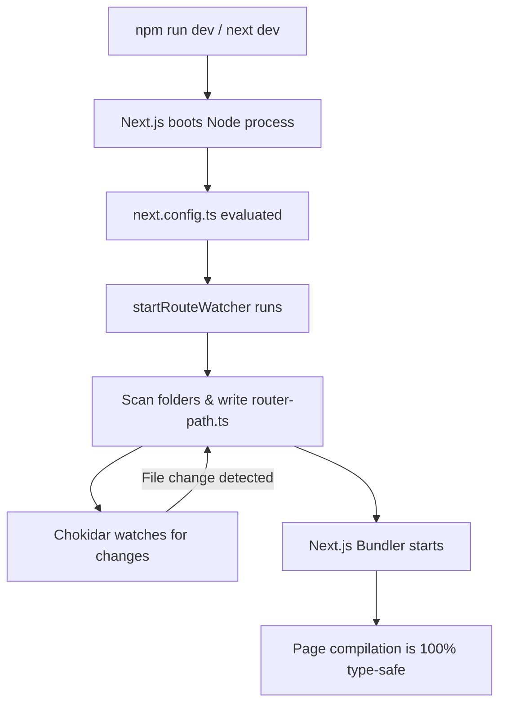
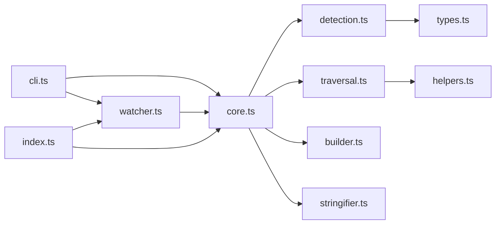

# @corrodekit/next-routes - Next.js Route Manifest Generator

A minimal overhead routing manifest generator for Next.js. This package **auto-generates type-safe route manifests**, eliminating type-unsafe routes. It scans your `app/` and `pages/` directories, understands route groups, dynamic slugs, and catch-alls, and produces a statically typed `ROUTES` dictionary at both dev-time and build-time.

No more silent runtime errors. Just reliable, type-checked routes that scale with your project.

---

## The Problem

Next.js has a **type-unsafe routes** or **magic string routes** problem. When navigating between pages, you hardcode route paths as strings:

```typescript
router.push("/dashboard/analytics"); // What if you rename the folder?
```

If you ever rename a folder, move a page, or restructure your app — **nothing breaks at compile time**. The bug silently ships to production.

## The Solution

`@corrodekit/next-routes` automatically scans your `app/` and `pages/` directories and generates a statically-typed `ROUTES` object. Every route path becomes a **type-safe constant** — rename a folder and TypeScript catches it instantly.

---

## Features

- **Zero Runtime Overhead** — Generates a static TypeScript file with `as const` assertions
- **Auto-Detection** — Scans `src/app`, `app`, `src/pages`, and `pages` automatically
- **Next.js Base Path Support** — Reads `basePath` from `next.config.ts/js` and applies it
- **Change-Detection Writes** — Only writes when routes actually change, preventing infinite dev server loops
- **Route Groups & Interceptors** — Correctly handles `(group)` transparency and skips `(.)` interceptors
- **Cross-Platform Watching** — Uses [chokidar](https://github.com/paulmillr/chokidar) for reliable file watching on Windows, macOS, and Linux

---

## Requirements

- **Node.js** >= 18.0.0
- **Next.js** >= 13.0.0

---

## Installation

```bash
npm install @corrodekit/next-routes
```

---

## Quick Start

### 1. Programmatic Hook in `next.config.ts` (Recommended)

Invoke the watcher directly in your Next.js config so routes are generated **before** compilation begins:

```typescript
// next.config.ts
import type { NextConfig } from "next";
import { startRouteWatcher } from "@corrodekit/next-routes";

const nextConfig: NextConfig = {
  // Your config
};

// Starts watching in development — dormant in production
startRouteWatcher();

export default nextConfig;
```

With optional overrides:

```typescript
// Optional
startRouteWatcher({
  outputPath: "src/app/generated/routes.ts", // Programmatic override (optional)
  routerType: "both",
});
```

### 2. Pre-Build Script in `package.json`

Generate routes before the production build:

```json
{
  "scripts": {
    "dev": "next dev",
    "build": "corrode-routes && next build"
  }
}
```

### 3. CLI

```bash
# One-shot generation
npx corrode-routes

# Watch mode
npx corrode-routes --watch

# Custom output path
npx corrode-routes --output src/routes.ts

# Scan both app and pages directories
npx corrode-routes --router-type both
```

---

## Output Example

Given this folder structure:

```
app/
  page.tsx
  auth/
    login/page.tsx
    forgot-password/page.tsx
  dashboard/
    page.tsx
    analytics/page.tsx
    catalog/tracks/[id]/page.tsx
```

The generated file:

```typescript
/**
 * Auto-generated Route Paths By @corrodekit/next-routes
 *
 * ──────────────────────────────────────────────────────────
 * ⚠️  DO NOT MANUALLY EDIT THIS FILE — IT IS AUTO-GENERATED
 * ──────────────────────────────────────────────────────────
 */

export const ROUTES = {
  AUTH: {
    FORGOT_PASSWORD: "/auth/forgot-password",
    LOGIN: "/auth/login",
  },
  DASHBOARD: {
    ANALYTICS: "/dashboard/analytics",
    CATALOG: {
      TRACKS: {
        ID: (params: { id: string | number }) =>
          `/dashboard/catalog/tracks/${params.id}`,
      },
    },
    ROOT: "/dashboard",
  },
  HOME: "/",
} as const;

export type RoutePath = typeof ROUTES;
```

Now you can use it with full type safety:

```typescript
import { ROUTES } from "@/app/router-path";

router.push(ROUTES.DASHBOARD.ANALYTICS);
router.push(ROUTES.DASHBOARD.CATALOG.TRACKS.ID({ id: 42 }));
```

---

## Configuration

By default, the package auto-detects everything. You can customize behavior by creating a `routes.config.json` in your project root:

```json
{
  "outputPath": "src/app/generated/routes.ts",
  "routerType": "auto",
  "ignore": ["_components", "__tests__"]
}
```

### Config Options

| Option       | Type                                   | Default                    | Description                                         |
| :----------- | :------------------------------------- | :------------------------- | :-------------------------------------------------- |
| `appDir`     | `string`                               | _Auto-detected_            | Custom path to the App Router directory.            |
| `pagesDir`   | `string`                               | _Auto-detected_            | Custom path to the Pages Router directory.          |
| `outputPath` | `string`                               | `"src/app/router-path.ts"` | Target file path for the generated TypeScript file. |
| `basePath`   | `string`                               | _Auto-detected_            | Prepends a prefix path to all routes.               |
| `ignore`     | `string[]`                             | `[]`                       | Extra folder names to skip during scanning.         |
| `routerType` | `"app" \| "pages" \| "both" \| "auto"` | `"auto"`                   | Restricts parsing to a specific router pattern.     |

### Router Type Resolution

- **`"auto"` (Default)** — Detects which directory exists. Prioritizes `app/` if present.
- **`"app"`** — Only scans the App Router (`app/` or `src/app/`).
- **`"pages"`** — Only scans the Pages Router (`pages/` or `src/pages/`).
- **`"both"`** — Scans both directories and merges into a single route dictionary.

---

## CLI Reference

```
corrode-routes [options]

Options:
  --watch              Watch for file changes and regenerate routes
  --output <path>      Custom output file path (default: auto-detected)
  --base-path <path>   Base path prefix for all routes
  --router-type <type> Router type: app, pages, both, auto (default: auto)
  --help               Show this help message
```

---

## Package Structure

```
@corrodekit/next-routes/
├── src/
│   ├── types.ts          # Shared interfaces, type guards, and config schemas
│   ├── helpers.ts        # Utility functions (debounce, key generation, ignore logic)
│   ├── detection.ts      # Auto-detection of app/pages dirs, basePath, config loading
│   ├── traversal.ts      # Pure directory scanners (App Router + Pages Router)
│   ├── builder.ts        # Nested tree builder (flat record → hierarchy)
│   ├── stringifier.ts    # TypeScript code-generator (tree → TS source string)
│   ├── core.ts           # Main orchestrator (scan → build → write)
│   ├── watcher.ts        # File watcher (chokidar-powered, cross-platform)
│   ├── cli.ts            # CLI entry point (arg parsing + dispatch)
│   └── index.ts          # Public API barrel export
├── tests/
│   ├── helpers.test.ts
│   ├── builder.test.ts
│   ├── stringifier.test.ts
│   └── traversal.test.ts
├── package.json
├── tsconfig.json
├── tsup.config.ts
├── LICENSE
└── README.md
```

---

## How It Works



---

## Internal Architecture

If you are exploring the codebase, the package is built using strict single-responsibility modules:



---

## License

[MIT](./LICENSE)
